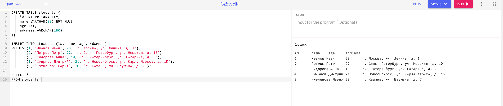

# Задача №1: Проверить XML, правильно ли он составлен, не имеет ли он ошибок, если есть какие-либо недочеты, предоставьте правильный вариант в файле 1.xml
```
<req>
<surname>Иванов</surname>
<name>Иван</name>
<patronymic>Иванович</patronymic>
<birthdate>01.01.1990</birthdate>
<birthplace>Москва</birthplace>
<phone>8 926 766 48 48</phone>
</req
```
### В данном XML-файле есть ошибка: отсутствует закрывающий угловой скобочный символ ">" у тега <req>. Это может привести к неправильной обработке попытке его прочитать. 

### решение представлено в файле test.xml

.
# Задача №2: Проверить JSON, правильно ли он составлен, не имеет ли он ошибок, если есть какие-либо недочеты, предоставьте правильный вариант в файле 2.json:

```
{
    "surname": "Иванов"
    
    "name": "Иван"
    
    "patronymic": "Иванович"
    
    "birthdate": "01.01.1990"
    
    "birthplace": "Москва"
    
    "phone": "8 926 766 48 48"
    
    }
```
### Нет запятых между полями, кроме последнего, правильный json приложен в файле test2.json
.

## Задача №3: Составить json по таблице, созданной при выполнении 4-го дз. (информация об одногруппниках с четырьмя полями: id, name, age, address.) Ответ представить в виде файла 3.json и прикрепить скрин, отображающий вид таблицы.

### Таблица MySQL


json - файл приложен в файле test4.json